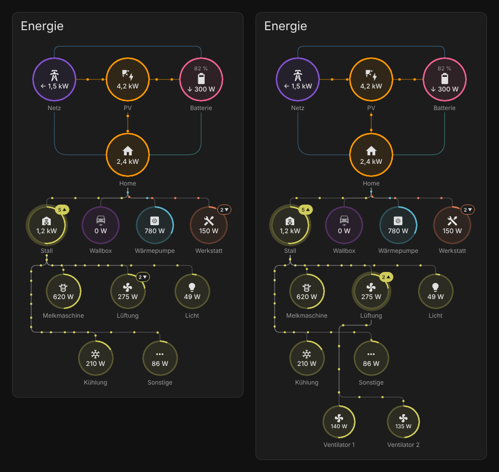

# Nested Power Flow Card

Eine Energiefluss-Karte für Home Assistant, bei der Geräte **Untergeräte** haben können.
Aus "Stall" wird so eine Gruppe: Ein Klick darauf klappt auf, was im Stall gerade Strom zieht, und das beliebig tief (Stall → Lüftung → Ventilator 1).



- Netz, Solar, Batterie und Haus mit animiertem Fluss
- Geräte und Gruppen in beliebiger Tiefe, per Klick auf- und zuklappbar
- Visueller Editor: Gruppen anlegen, Untergeräte hinzufügen, sortieren, Farbe wählen
- Ring um jedes Gerät zeigt den Anteil am Verbrauch der übergeordneten Gruppe
- "Sonstige" zeigt in einer Gruppe den Rest, der keinem Untergerät zugeordnet ist
- Passt sich an Kartenbreite und an helles und dunkles Theme an
- Eine Datei, keine Abhängigkeiten

## Installation über HACS

1. HACS öffnen → oben rechts die drei Punkte → **Benutzerdefinierte Repositories**
2. Repository `https://github.com/Flecksel/myhomeassistan` eintragen, Typ **Dashboard**
3. "Nested Power Flow Card" suchen und herunterladen
4. Browser neu laden (Strg+F5)

Das Repository muss dafür öffentlich sein.

### Manuell

`dist/nested-power-flow-card.js` nach `config/www/` kopieren und unter
*Einstellungen → Dashboards → Ressourcen* als JavaScript-Modul eintragen:
`/local/nested-power-flow-card.js`

## Benutzung

Dashboard bearbeiten → Karte hinzufügen → **Nested Power Flow Card**.
Im Editor wählst du die Sensoren für Netz, Solar und Batterie und legst unter
**Geräte & Gruppen** deine Geräte an. Ein Gerät aufklappen und
**Untergerät hinzufügen** macht es zur Gruppe.

In der Karte:

- Klick auf eine Gruppe: Untergeräte auf- oder zuklappen
- Klick auf ein Gerät: Verlauf des Sensors öffnen
- Lange drücken (oder Rechtsklick) auf eine Gruppe: Verlauf des Gruppen-Sensors

Pro Ebene ist immer eine Gruppe geöffnet, damit die Karte übersichtlich bleibt.

## Beispiel (YAML)

```yaml
type: custom:nested-power-flow-card
title: Energie
grid:
  entity: sensor.netz_leistung        # positiv = Bezug, negativ = Einspeisung
solar:
  entity: sensor.pv_leistung
  name: PV
battery:
  entity: sensor.batterie_leistung    # positiv = Entladen, negativ = Laden
  soc_entity: sensor.batterie_ladezustand
home:
  name: Home
devices:
  - name: Stall
    entity: sensor.stall_leistung
    icon: mdi:barn
    children:
      - name: Melkmaschine
        entity: sensor.melkmaschine_leistung
        icon: mdi:cow
      - name: Lüftung                 # ohne Sensor: Summe der Untergeräte
        icon: mdi:fan
        children:
          - name: Ventilator 1
            entity: sensor.ventilator_1_leistung
          - name: Ventilator 2
            entity: sensor.ventilator_2_leistung
      - name: Licht
        entity: sensor.stall_licht_leistung
        icon: mdi:lightbulb
  - name: Wallbox
    entity: sensor.wallbox_leistung
    icon: mdi:car-electric
```

## Optionen

### Karte

| Option | Standard | Beschreibung |
| --- | --- | --- |
| `title` | | Überschrift der Karte |
| `kilo_threshold` | `1000` | Ab wie viel Watt in kW angezeigt wird |
| `kilo_decimals` | `1` | Nachkommastellen bei kW |
| `base_decimals` | `0` | Nachkommastellen bei W |
| `show_other` | `true` | "Sonstige" in Gruppen mit eigenem Sensor anzeigen |
| `sort` | `false` | Geräte nach Leistung sortieren |
| `zero_tolerance` | `0` | Werte bis zu dieser Wattzahl gelten als 0 |
| `max_expected_power` | `3000` | Leistung, bei der die Punkte am schnellsten laufen |

### `grid`, `solar`, `battery`, `home`

| Option | Gilt für | Beschreibung |
| --- | --- | --- |
| `entity` | alle | Leistungs-Sensor (W oder kW) |
| `import_entity`, `export_entity` | grid | Getrennte Sensoren statt `entity` |
| `charge_entity`, `discharge_entity` | battery | Getrennte Sensoren statt `entity` |
| `soc_entity` | battery | Ladezustand in Prozent |
| `invert` | grid, solar, battery | Vorzeichen umkehren |
| `override_state` | home | Sensorwert statt berechnetem Hausverbrauch zeigen |
| `secondary_entity` | alle | Zweiter Wert klein im Kreis |
| `name`, `icon`, `color` | alle | Beschriftung, Symbol, Farbe |

Der Hausverbrauch wird aus Netz, Solar und Batterie berechnet. Ein `home.entity` brauchst du nur, wenn du den Wert überschreiben oder den Verlauf per Klick öffnen willst.

### `devices` (Geräte und Gruppen)

| Option | Beschreibung |
| --- | --- |
| `name`, `icon`, `color` | Beschriftung, Symbol, Farbe (Untergeräte erben die Farbe) |
| `entity` | Leistungs-Sensor. Fehlt er bei einer Gruppe, wird die Summe der Untergeräte gezeigt |
| `children` | Liste von Untergeräten, gleiche Optionen wie hier |
| `secondary_entity` | Zweiter Wert klein im Kreis |
| `display_zero` | `false` blendet das Gerät bei 0 W aus |
| `expanded` | `true` klappt die Gruppe beim Laden auf |
| `invert` | Vorzeichen umkehren |
